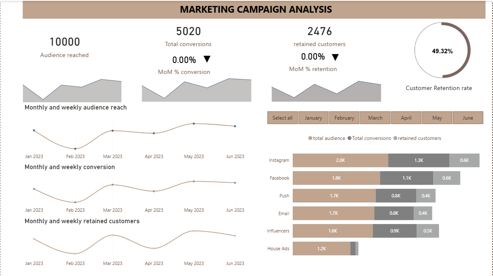

<!-- Section 1: Introduction -->
## ABOUT ME

Hello! I'm **Esther Okolie** 👋, I have spent the past four years learning data analysis the hard way - by actually doing it.
Not just following tutorials. Building real projects. Analyzing messy datasets. Asking questions that don't have obvious answers.

When I analyzed fashion retail sales data, I didn't just build a dashboard showing which brands sold the most. I compared high-volume brands against high-revenue brands and found something more valuable: some brands were moving a lot of product but generating thin margins because of aggressive discounting. That's the kind of insight that changes pricing strategy, not just updates a report.
That's how I approach data analytics and business intelligence work - I don't stop at the surface numbers. I dig into what's actually driving performance, what's being missed, and what decisions the data should inform.

I work primarily with SQL for data extraction and querying, Excel and Power BI modeling, analysis and visualization. But tools are just tools. What matters is knowing which questions to ask and how to structure analysis that actually supports business decisions.

Before transitioning into analytics, I spent two years doing data entry and validation at JMG Limited in Lagos. It wasn't glamorous work, but it taught me something critical: garbage in, garbage out. Data quality matters. Accuracy matters. That foundation shapes every analytical project I touch now.

I have a Bachelor's degree from the University of Port Harcourt and a Data Analysis Diploma from TechOrigin Technology Development. 

Right now, I'm working on projects in retail analytics, marketing campaign analysis, and sales performance reporting - all of which you can explore in my portfolio. Each project demonstrates end-to-end analytical work: data cleaning, exploratory analysis, data modeling, visualization, and communicating findings clearly.

What I'm looking for: a data analyst or business intelligence analyst role where I can apply this combination of technical skills, business thinking, and communication to help organizations make smarter, faster, evidence-based decisions.

If you need someone who can clean messy data, build dashboards that answer real questions, write SQL queries that extract the right information, and explain findings to stakeholders who don't live in spreadsheets - let's talk.

<!-- Section 3: Portfolio Projects -->
## MY PORTFOLIO

*A selection of projects that demonstrate my analytical approach and problem-solving skills.*

### Fashion Retail Sales Analysis

This project analyzes sales performance for a multi-brand fashion retail store using transactional order and product data. The goal is to identify key revenue drivers, demand patterns across brands and categories, and assess the impact of discounting on pricing efficiency and profitability.

Key focus areas:

Brand-level revenue and order volume analysis to identify top- and underperforming brands

Category performance evaluation using average selling price and discount metrics

Comparison of high-volume versus high-revenue brands to uncover pricing and demand dynamics

Identification of discount-heavy categories with potential margin risk

The dashboard delivers actionable insights to support brand portfolio optimization, pricing strategy, and discount management.  
[Read more](Fashion_Sales_Analysis_Portfolio.pdf)

### Marketing Campaign Analysis

This project evaluates the effectiveness of a multi-channel marketing campaign using customer and campaign performance data. The analysis focuses on understanding which channels, customer segments, and campaign strategies generated the highest engagement and return on investment (ROI).

Key analytical areas include:
- Campaign reach, conversion rates, and retention rate
- Performance comparison across channels (email, social media, influencers, push)
- Customer segmentation based on response behavior
- Identification of high-performing campaigns and underperforming spend

The insights from this analysis support data-driven decisions on budget allocation, campaign optimization, and targeting strategies to improve future marketing outcomes.  
[Read More](Marketing_Campaign_analysis_Presentation.pdf)

### Parche & Possey Paper Sales Analysis ( Microsoft SQL Server)

This project analyzes Parche & Possey database, a paper-selling company, to answer common business questions about customers (accounts), orders, pricing, sales reps, regions, and channel performance. 
The analysis insights supports decisions on:

Customer base size  
Web channel mix  
Order quantity behavior (max/min/avg)  
High-value customers  
Order frequency patterns  
Time-based demand patterns (weekday/hour/month-year)  
Order segmentation (high/medium/small)  
Top accounts by order volume  
Sales rep workload and performance by region  
[See the analysis file](Parche and possey analysis.pdf)

<!-- Section 4: Contact -->
## CONTACT DETAILS

*Let’s connect and explore how data can create value.*

<table>
  <tbody>
    <tr>
      <td>📧</td>
      <td><a href="mailto:estherokolie@outlook.com">estherokolie@outlook.com</a></td>
    </tr>
    <tr>
      <td>📞</td>
      <td>(+1) 587-777-5503</td>
    </tr>
    <tr>
      <td>📍</td>
      <td>Canada</td>
    </tr>
    <tr>
      <td>⬇️</td>
      <td><a href="https://github.io/estherokolie/cv.pdf">Download my CV</a></td>
    </tr>
    <tr>
      <td>🌐</td>
      <td><a href="https://linkedin.com/in/esther-okolie-b88381368">Connect with me on LinkedIn</a></td>
    </tr>
  </tbody>
</table>
