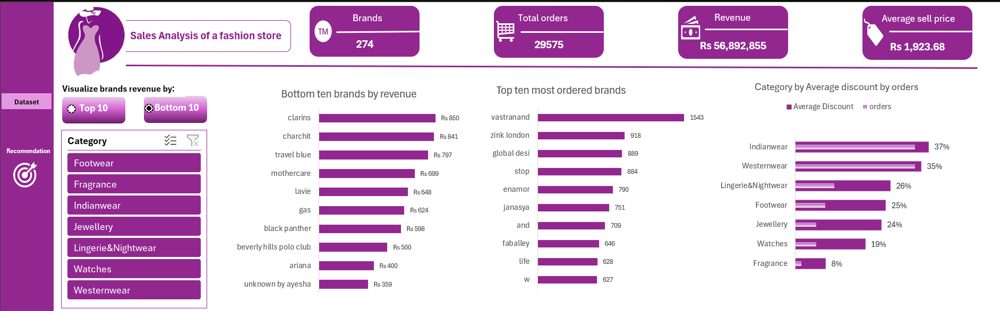
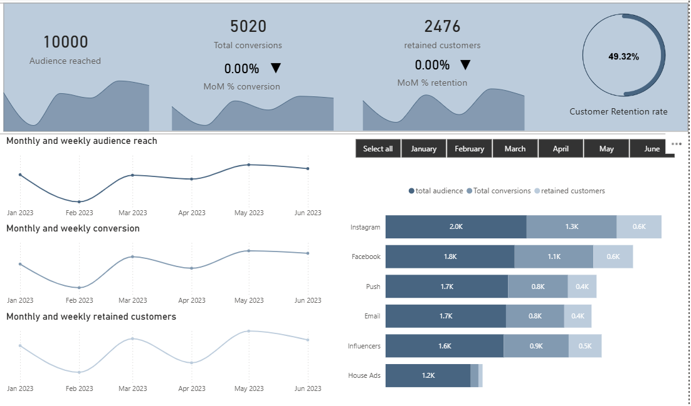
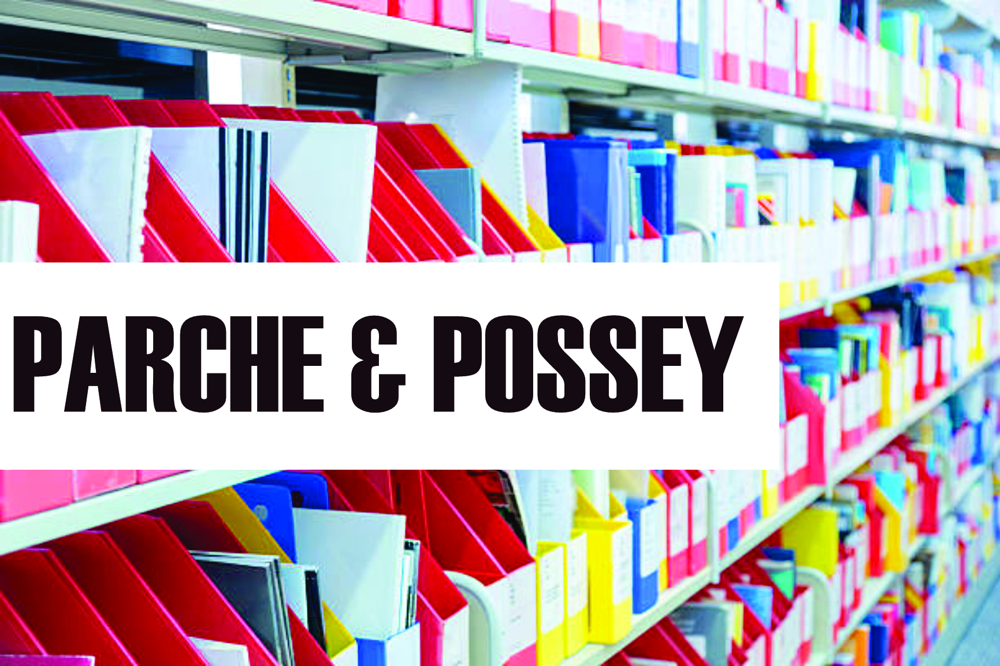

<!-- Section 1: Introduction -->
## ABOUT ME

Hello! I'm **Esther Okolie** 👋, a data analyst and business intelligence enthusiast with a strong passion for transforming raw data into clear, actionable insights. I work across business domains such as sales, operations, finance, and customer experience, helping organizations make better, faster, and evidence-based decisions.
I enjoy solving business problems with data, building intuitive dashboards, and communicating insights in a way that decision-makers can easily understand and act on.

<!-- Section 2: Value Proposition -->
## THE VALUE I BRING

*As a data analyst, I support organizations in leveraging data for strategic and operational excellence.*

**- ✅ Data Analytics & Business Intelligence**
I analyze complex datasets to uncover trends, patterns, and insights that support strategic decision-making, performance improvement, and growth.

**- ✅ Data Visualization & Reporting**
I design clear, interactive dashboards and reports that communicate insights effectively to technical and non-technical stakeholders.

<!-- Section 3: Portfolio Projects -->
## MY PORTFOLIO

*A selection of projects that demonstrate my analytical approach and problem-solving skills.*

### Fashion Retail Sales Analysis

This project analyzes sales performance for a multi-brand fashion retail store using transactional order and product data. The goal is to identify key revenue drivers, demand patterns across brands and categories, and assess the impact of discounting on pricing efficiency and profitability.

Key focus areas:

Brand-level revenue and order volume analysis to identify top- and underperforming brands

Category performance evaluation using average selling price and discount metrics

Comparison of high-volume versus high-revenue brands to uncover pricing and demand dynamics

Identification of discount-heavy categories with potential margin risk

The dashboard delivers actionable insights to support brand portfolio optimization, pricing strategy, and discount management.
[Read More](https://www.linkedin.com)

### Marketing Campaign Analysis

This project evaluates the effectiveness of a multi-channel marketing campaign using customer and campaign performance data. The analysis focuses on understanding which channels, customer segments, and campaign strategies generated the highest engagement and return on investment (ROI).

Key analytical areas include:
- Campaign reach, conversion rates, and customer acquisition cost (CAC)
- Performance comparison across channels (email, social media, paid ads)
- Customer segmentation based on response behavior
- Identification of high-performing campaigns and underperforming spend

The insights from this analysis support data-driven decisions on budget allocation, campaign optimization, and targeting strategies to improve future marketing outcomes.

[Read More](https://www.linkedin.com)

### Parche & Possey Paper Sales Analysis ( Microsoft SQL Server)

This project analyzes Parche & Possey database, a paper-selling company, to answer common business questions about customers (accounts), orders, pricing, sales reps, regions, and channel performance.

The analysis insights supports decisions on:

Customer base size

Web channel mix

Order quantity behavior (max/min/avg)

High-value customers

Order frequency patterns

Time-based demand patterns (weekday/hour/month-year)

Order segmentation (high/medium/small)

Top accounts by order volume

Sales rep workload and performance by region

[See the analysis file](https://www.linkedin.com)

<!-- Section 4: Contact -->
## CONTACT DETAILS

*Let’s connect and explore how data can create value.*

<table>
  <tbody>
    <tr>
      <td>📧</td>
      <td><a href="mailto:estherokolie@gmail.com">estherokolie@gmail.com</a></td>
    </tr>
    <tr>
      <td>📞</td>
      <td>(234) 800-000-0000</td>
    </tr>
    <tr>
      <td>📍</td>
      <td>Nigeria</td>
    </tr>
    <tr>
      <td>⬇️</td>
      <td><a href="https://github.io/estherokolie/cv.pdf">Download my CV</a></td>
    </tr>
    <tr>
      <td>🌐</td>
      <td><a href="https://linkedin.com/in/estherokolie">Connect with me on LinkedIn</a></td>
    </tr>
  </tbody>
</table>
